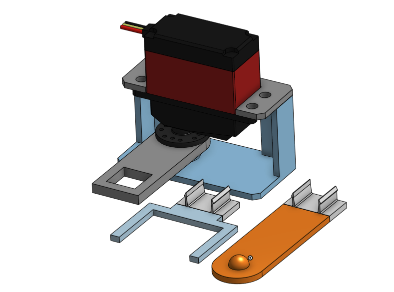

# Switcherbot

A device for mechanically flipping switches over the cloud.

## Device

The device, designed using OnShape, is powered by a RaspberryPi running a Flask web app for provisioning and an MQTT tunnel to Google Cloud IoT for receiving config and PubSub messages. Parts were 3D printed with PLA.

### Features
- Replaceable tips for different types of switches
- High torque digital servo for higher resistance switches

  
   
  
  

### Technical Details
- Flask app exposes REST API for provisioning device, resetting `dhcpcd.conf` and `wpa_supplicant.conf` to switch between access point mode and wireless mode
- `hostapd` is used to create an access point, where users connect to a static IP to access the API and send their wifi SSID and password to the device
- The device is registered to Google Cloud IoT using its public key, and then uses its private key to create an MQTT client for receiving configuration and commands via PubSub
- Python `pigpio` library used to generate an accurate PWM square waveform for the digital servo on the Raspberry Pi GPIO pins

## Web App

The web app for controlling and monitoring devices was created using Flask, PostgreSQL, Auth0, and Google Cloud IoT.

### Features
- "Homes" allow for users to share devices and manage permissions between several accounts
- Devices can be configured, monitored, and controlled from anywhere through the Switcherbot dashboard

### Technical Details
- A Google Cloud IoT service account is used to provide users access to their devices; commands and configuration updates are published on the relevant PubSub topics and are then consumed at least once (QoS 1)
- The frontend, built using Jinja2, is served by a Flask web app
- A PostgreSQL database stores relevant information on users, homes, devices, and permissions
- Auth0 is used for user authentication